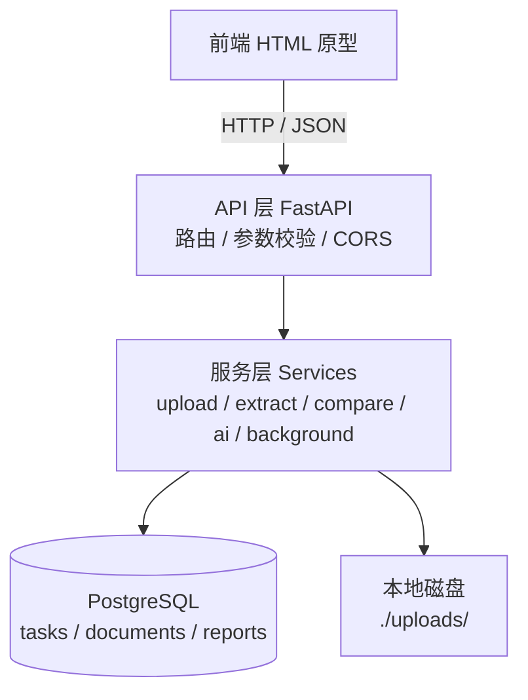
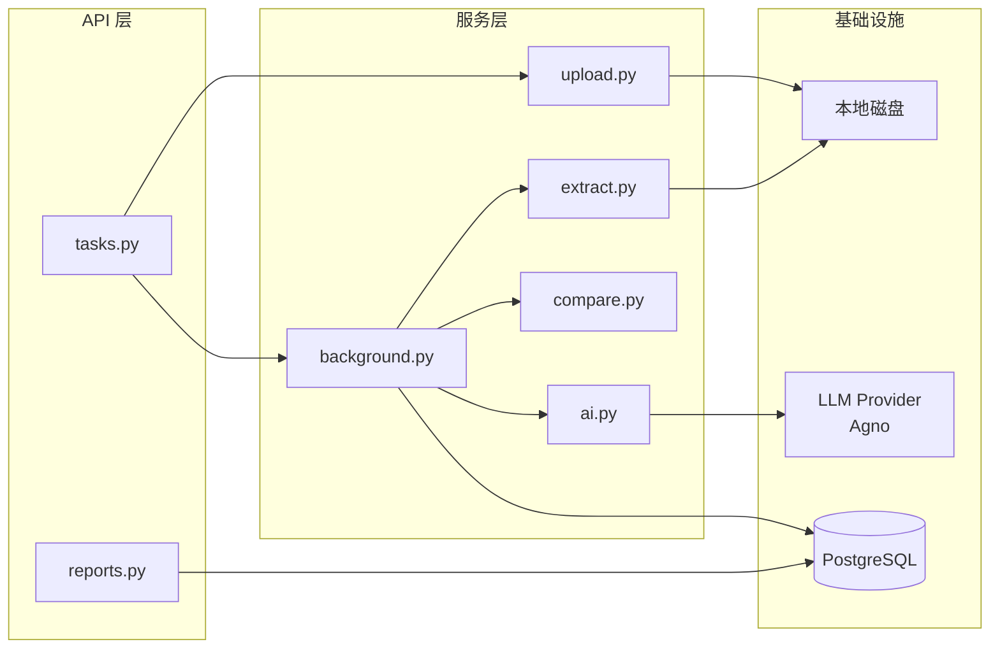
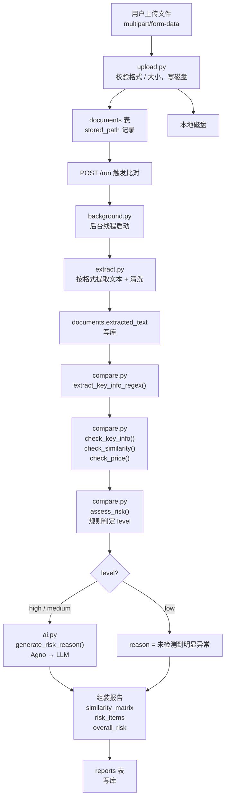
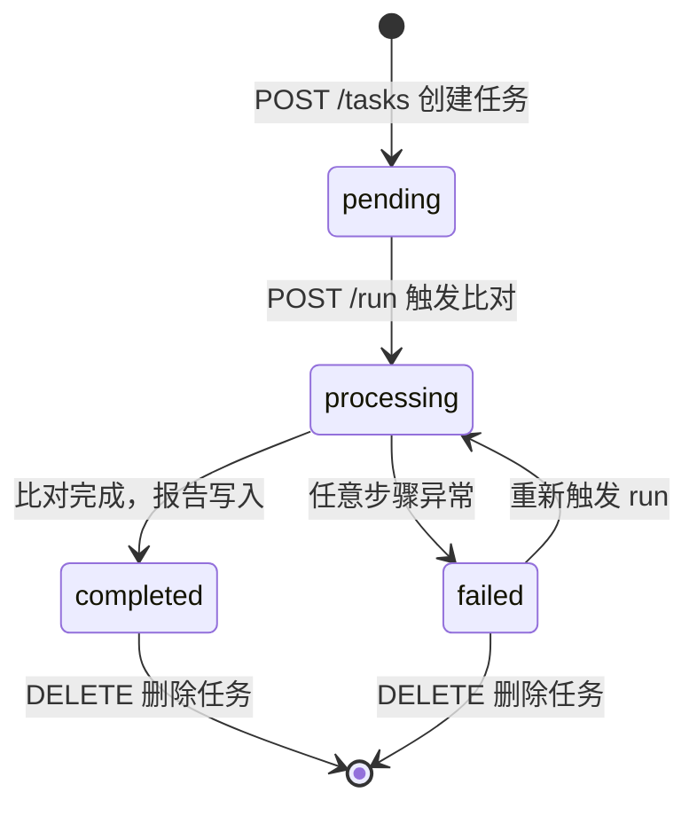
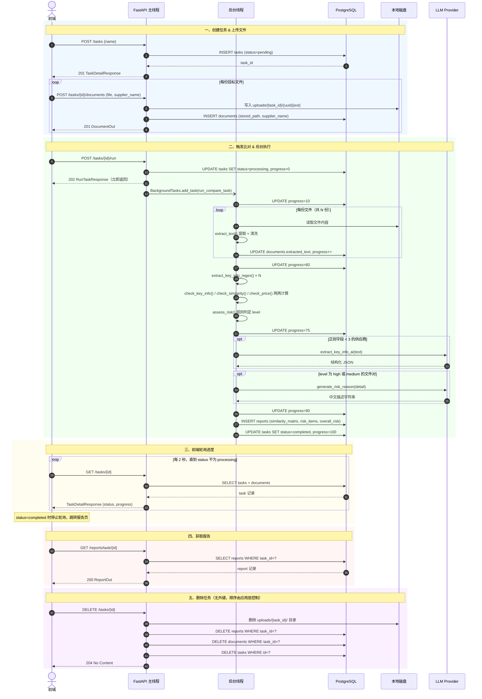

# 招标采购比对系统 — 后端技术方案（TECH_SPEC）

> 版本：v1.0（MVP）｜状态：待评审｜技术栈：Python 3.10 / FastAPI / PostgreSQL 16 / Docker

---

## 目录

1. [系统架构](#1-系统架构)
2. [数据模型](#2-数据模型)
3. [Pydantic Schema 定义](#3-pydantic-schema-定义)
4. [URL 路由定义](#4-url-路由定义)
5. [模块划分](#5-模块划分)
6. [接口定义](#6-接口定义)
7. [错误与异常定义](#7-错误与异常定义)
8. [部署](#8-部署)

---

## 1. 系统架构

### 1.1 分层架构



### 1.2 模块依赖图



### 1.2 技术选型

| 层级 | 选型 | 版本 | 用途 |
|------|------|------|------|
| 语言 | Python | 3.10 | |
| API 框架 | FastAPI | 0.115 | HTTP 路由、参数校验、自动生成 Swagger 文档 |
| AI Agent 编排 | Agno | 最新 | 封装 LLM 调用，只负责两个环节：关键信息结构化提取（正则兜底）、风险原因描述生成 |
| LLM 接入 | 可配置（OpenAI / Qwen 等） | — | 通过 Agno Model Provider 接入，与业务代码解耦 |
| 任务调度 | FastAPI BackgroundTasks | 内置 | MVP 阶段后台异步执行比对，无需 Celery/Redis |
| ORM | SQLAlchemy | 2.0 | 数据库访问，同步模式 |
| 数据库迁移 | Alembic | 1.13 | 版本化 Schema 迁移 |
| 数据库 | PostgreSQL | 16 | |
| PDF 提取 | PyMuPDF（fitz） | 1.24 | 仅支持可编辑 PDF，不支持扫描件 |
| Word 提取 | python-docx | 1.1 | .docx 格式 |
| 数据校验 | Pydantic v2 | 2.9 | 请求/响应 Schema 定义 |
| 配置管理 | pydantic-settings | 2.5 | 读取环境变量 |
| 文件上传 | python-multipart | 0.0.12 | multipart/form-data 解析 |
| 容器化 | Docker + Compose | 最新 | |

### 1.3 数据流图



### 1.4 依赖清单（requirements.txt）

```text
fastapi==0.115.0
uvicorn[standard]==0.30.6
sqlalchemy==2.0.35
alembic==1.13.3
psycopg2-binary==2.9.9
pydantic==2.9.2
pydantic-settings==2.5.2
python-multipart==0.0.12
aiofiles==24.1.0
pymupdf==1.24.11
python-docx==1.1.2
agno
```

### 1.5 项目目录结构

```
backend/
├── app/
│   ├── main.py              # FastAPI 入口：注册路由、CORS 中间件、lifespan
│   ├── core/
│   │   ├── config.py        # Settings（pydantic-settings），读取环境变量
│   │   └── database.py      # SQLAlchemy engine / SessionLocal / Base / get_db
│   ├── models/
│   │   └── models.py        # SQLAlchemy ORM 模型（Task / Document / Report）
│   ├── schemas/
│   │   └── schemas.py       # Pydantic Schema（见第 3 章）
│   ├── api/
│   │   ├── tasks.py         # /api/v1/tasks 路由
│   │   └── reports.py       # /api/v1/reports 路由
│   └── services/
│       ├── upload.py        # 文件校验 + 写磁盘
│       ├── extract.py       # 文本提取（PDF / DOCX / TXT）+ 清洗
│       ├── compare.py       # 算法检测：正则提取 / LCS / Jaccard / 相关系数 / 风险判定
│       ├── ai.py            # Agno Agent：关键信息 AI 提取 / 风险原因描述生成
│       └── background.py    # 后台任务编排（extract → compare → ai → 写报告）
├── alembic/
│   ├── env.py
│   ├── script.py.mako
│   └── versions/
│       └── 0001_initial.py
├── alembic.ini
├── requirements.txt
└── Dockerfile
```

### 1.6 main.py 关键配置

```python
from contextlib import asynccontextmanager
from fastapi import FastAPI
from fastapi.middleware.cors import CORSMiddleware
from app.api import tasks, reports

@asynccontextmanager
async def lifespan(app: FastAPI):
    # 启动时预留（如需检查数据库连接可在此添加）
    yield
    # 关闭时预留

app = FastAPI(
    title="招标采购比对系统",
    version="1.0.0",
    lifespan=lifespan,
)

app.add_middleware(
    CORSMiddleware,
    allow_origins=["*"],    # 生产环境改为具体前端域名
    allow_methods=["*"],
    allow_headers=["*"],
)

app.include_router(tasks.router,   prefix="/api/v1")
app.include_router(reports.router, prefix="/api/v1")

@app.get("/health")
def health():
    return {"status": "ok"}
```

---

## 2. 数据模型

### 2.1 ER 关系

```
tasks (1) ──< documents (N)    一个任务包含多份投标文件
tasks (1) ──  reports  (1)     一个任务对应一份比对报告（一对一）
```

删除 task 时，应用层代码负责先删除关联的 documents 记录、reports 记录及磁盘文件，再删除 task 记录。无数据库级联，删除顺序由代码控制。

### 2.2 tasks 表

| 字段 | 类型 | 约束 | 说明 |
|------|------|------|------|
| id | INTEGER | PK, AUTOINCREMENT | 任务 ID |
| name | VARCHAR(255) | NOT NULL | 任务名称 |
| status | ENUM(taskstatus) | NOT NULL, DEFAULT `pending` | `pending` / `processing` / `completed` / `failed` |
| progress | INTEGER | NOT NULL, DEFAULT 0 | 进度值 0–100，供前端轮询展示 |
| error_message | TEXT | NULLABLE | 任务失败时写入异常信息 |
| created_at | TIMESTAMP | NOT NULL, DEFAULT now() | 创建时间 |
| updated_at | TIMESTAMP | NOT NULL, DEFAULT now() | 最后更新时间；**ORM 须配置 `onupdate=datetime.utcnow`，否则 UPDATE 时不会自动刷新** |

### 2.3 documents 表

| 字段 | 类型 | 约束 | 说明 |
|------|------|------|------|
| id | INTEGER | PK, AUTOINCREMENT | 文件 ID |
| task_id | INTEGER | NOT NULL, INDEX | 所属任务；应用层保证引用完整性，无数据库外键约束 |
| supplier_name | VARCHAR(255) | NOT NULL | 供应商名称，上传时由用户填写 |
| original_filename | VARCHAR(512) | NOT NULL | 原始文件名，用于报告展示 |
| stored_path | VARCHAR(512) | NOT NULL | 磁盘路径：`uploads/{task_id}/{uuid}{ext}` |
| file_size | INTEGER | NULLABLE | 文件字节数 |
| extracted_text | TEXT | NULLABLE | 提取并清洗后的纯文本；比对完成后写入 |
| uploaded_at | TIMESTAMP | NOT NULL, DEFAULT now() | 上传时间 |

### 2.4 reports 表

| 字段 | 类型 | 约束 | 说明 |
|------|------|------|------|
| id | INTEGER | PK, AUTOINCREMENT | 报告 ID |
| task_id | INTEGER | UNIQUE, NOT NULL, INDEX | 关联任务（一对一）；应用层保证引用完整性，无数据库外键约束 |
| similarity_matrix | JSONB | NULLABLE | 两两相似度矩阵（见 2.6） |
| risk_items | JSONB | NULLABLE | 风险项列表，仅含 medium / high（见 2.6） |
| overall_risk | ENUM(risklevel) | NULLABLE | 整体风险等级 |
| generated_at | TIMESTAMP | NOT NULL, DEFAULT now() | 报告生成时间 |

### 2.5 枚举类型

```sql
CREATE TYPE taskstatus AS ENUM ('pending', 'processing', 'completed', 'failed');
CREATE TYPE risklevel  AS ENUM ('high', 'medium', 'low');
```

### 2.6 JSONB 字段结构

**similarity_matrix** — 所有供应商两两相似度（0–100，保留 1 位小数，矩阵对称）

```json
{
  "供应商A": { "供应商B": 78.5, "供应商C": 12.3 },
  "供应商B": { "供应商A": 78.5, "供应商C": 15.0 },
  "供应商C": { "供应商A": 12.3, "供应商B": 15.0 }
}
```

**risk_items** — 风险项列表（仅含 medium / high，low 不写入）

```json
[
  {
    "supplier_a": "供应商A",
    "supplier_b": "供应商B",
    "level": "high",
    "reason": "经营地址完全一致；文件雷同比例78.5%，最长连续相同段落215字，高度疑似围标，建议重点核查。",
    "detail": {
      "key_info_match": ["经营地址", "联系电话"],
      "similarity_ratio": 78.5,
      "lcs_length": 215,
      "price_correlation": 0.997,
      "price_values": {
        "供应商A": 1052000.0,
        "供应商B": 925000.0
      }
    }
  }
]
```

**字段说明：**

| 字段 | 类型 | 说明 |
|------|------|------|
| `level` | string | 风险等级，由规则算法判定，不经过 AI |
| `reason` | string | 由 Agno AI 生成的中文描述；`AI_ENABLED=false` 时由规则层拼接模板字符串 |
| `detail.key_info_match` | string[] | 完全一致的关键信息字段列表 |
| `detail.similarity_ratio` | float | Jaccard 算法计算的雷同比例，0–100 |
| `detail.lcs_length` | int | 最长公共连续子串字数 |
| `detail.price_correlation` | float \| null | 皮尔逊相关系数；提取数值不足时为 null |
| `detail.price_values` | dict | 各供应商报价数值（元），用于前端渲染柱状图；提取失败时对应值为 null |

---

## 3. Pydantic Schema 定义

> 所有 Schema 定义在 `app/schemas/schemas.py`。

### 3.1 枚举

```python
from enum import Enum

class TaskStatus(str, Enum):
    pending    = "pending"
    processing = "processing"
    completed  = "completed"
    failed     = "failed"

class RiskLevel(str, Enum):
    high   = "high"
    medium = "medium"
    low    = "low"
```

### 3.2 Document Schema

```python
class DocumentOut(BaseModel):
    id:                int
    task_id:           int
    supplier_name:     str
    original_filename: str
    file_size:         Optional[int]        = None
    uploaded_at:       datetime

    model_config = ConfigDict(from_attributes=True)
```

### 3.3 Task Schema

```python
# POST /tasks 请求体
class TaskCreate(BaseModel):
    name: str = Field(..., min_length=1, max_length=255)

# GET /tasks 列表单项（轻量，不含 documents）
class TaskListItem(BaseModel):
    id:             int
    name:           str
    status:         TaskStatus
    progress:       int
    created_at:     datetime
    document_count: int

    model_config = ConfigDict(from_attributes=True)

# GET /tasks 响应（含分页元信息）
class TaskListResponse(BaseModel):
    items:       list[TaskListItem]
    total:       int
    page:        int
    limit:       int
    total_pages: int

# GET /tasks/{id} 及 POST /tasks 响应
class TaskDetailResponse(BaseModel):
    id:            int
    name:          str
    status:        TaskStatus
    progress:      int
    error_message: Optional[str]       = None
    created_at:    datetime
    updated_at:    datetime
    documents:     list[DocumentOut]   = []

    model_config = ConfigDict(from_attributes=True)
```

### 3.4 Report Schema

```python
class RiskDetail(BaseModel):
    key_info_match:    list[str]
    similarity_ratio:  float
    lcs_length:        int
    price_correlation: Optional[float]             = None
    price_values:      dict[str, Optional[float]]  = {}

class RiskItem(BaseModel):
    supplier_a: str
    supplier_b: str
    level:      RiskLevel
    reason:     str
    detail:     RiskDetail

class ReportOut(BaseModel):
    id:                int
    task_id:           int
    similarity_matrix: Optional[dict[str, dict[str, float]]] = None
    risk_items:        Optional[list[RiskItem]]               = None
    overall_risk:      Optional[RiskLevel]                    = None
    generated_at:      datetime

    model_config = ConfigDict(from_attributes=True)
```

### 3.5 其他响应 Schema

```python
# POST /tasks/{id}/run 响应
class RunTaskResponse(BaseModel):
    message:  str
    task_id:  int

# DELETE /tasks/{id}：HTTP 204，无响应体
# GET /health：直接返回 {"status": "ok"}，无需专用 Schema
```

---

## 4. URL 路由定义

基础前缀：`/api/v1`

| 方法 | 路径 | 说明 | 状态码 | 请求 Schema | 响应 Schema |
|------|------|------|--------|------------|------------|
| POST | `/tasks` | 创建比对任务 | 201 | `TaskCreate` | `TaskDetailResponse` |
| GET | `/tasks` | 获取任务列表 | 200 | Query: page, limit | `TaskListResponse` |
| GET | `/tasks/{task_id}` | 获取任务详情（轮询） | 200 | — | `TaskDetailResponse` |
| DELETE | `/tasks/{task_id}` | 删除任务及关联文件 | 204 | — | 无响应体 |
| POST | `/tasks/{task_id}/documents` | 上传投标文件 | 201 | multipart/form-data | `DocumentOut` |
| POST | `/tasks/{task_id}/run` | 触发比对任务 | 202 | — | `RunTaskResponse` |
| GET | `/reports/task/{task_id}` | 获取比对报告 | 200 | — | `ReportOut` |
| GET | `/health` | 健康检查 | 200 | — | `{"status": "ok"}` |

---

## 5. 模块划分

### 5.1 `services/upload.py` — 文件上传

**职责：**
- 校验文件扩展名白名单：`.txt` / `.pdf` / `.docx`（大小写不敏感）
- 校验文件大小 ≤ `MAX_UPLOAD_SIZE_MB`，超出抛 HTTP 413
- 校验文件内容非空（> 0 字节），空文件抛 HTTP 400
- 按规则 `uploads/{task_id}/{uuid4}{ext}` 写入磁盘，目录不存在时自动创建
- 返回 `stored_path`（str）和 `file_size`（int）

**边界：**
- 不做文本提取
- 不校验文件内容是否损坏（损坏文件在 `extract.py` 阶段处理）

**已知限制：**
- 同一任务并发上传时，文件数上限（20 份）的校验存在竞态条件。MVP 单用户场景概率极低，暂不加锁。后续可用 `SELECT ... FOR UPDATE` 行级锁解决。

---

### 5.2 `services/extract.py` — 文本提取

**统一入口：** `extract_text(stored_path: str) -> str`

根据扩展名分发，任意异常均捕获后返回 `""`，不向上抛出：

| 格式 | 实现 |
|------|------|
| `.txt` | `open(path, encoding="utf-8", errors="ignore").read()` |
| `.pdf` | `fitz.open()` 逐页 `page.get_text()`，按页拼接 |
| `.docx` | `python-docx` 逐 `paragraph.text` 拼接 |

**文本清洗（提取后统一执行，按顺序）：**

1. 合并连续空白为单个空格：`re.sub(r'\s+', ' ', text)`
2. 去除常见法律模板语句（正则匹配整句删除）：
   - `《中华人民共和国.*?》` 开头的句子
   - `根据.*?规定` 开头的句子
   - 以 `本公司郑重承诺`、`特此声明`、`以上内容真实有效` 开头的句子
3. 去除页码特征行（纯数字行、`-第\d+页-` 格式）
4. 若清洗后有效字符数 < 100，视为提取失败，返回 `""`，写 WARNING 日志

**边界：**
- 不支持扫描件 PDF（提取结果为空，调用方按 `""` 处理）
- 不支持 `.doc` 旧版 Word
- `.docx` 内的表格文本暂不提取（后续迭代）

---

### 5.3 `services/compare.py` — 算法检测模块

纯算法，无 LLM 调用，所有函数为纯函数，可独立单元测试。

---

**`extract_key_info_regex(text: str) -> dict[str, Optional[str]]`**

用正则从单份文件提取关键信息字段，返回：

```python
{
    "经营地址":    str | None,
    "联系电话":    str | None,
    "社会信用代码": str | None,
    "法人代表":    str | None,
    "委托人姓名":  str | None,
}
```

各字段匹配的前缀关键词（任意一个命中即提取其后内容）：

| 字段 | 前缀关键词 |
|------|-----------|
| 经营地址 | `经营地址`、`经营场所`、`公司地址`、`注册地址`、`通讯地址` |
| 联系电话 | `联系电话`、`联系方式`、`电话`、`Tel`、`TEL` |
| 社会信用代码 | `统一社会信用代码`、`社会信用代码`、`信用代码` |
| 法人代表 | `法定代表人`、`法人代表`、`法人` |
| 委托人姓名 | `授权委托人`、`委托人`、`代理人` |

---

**`check_key_info(info_a: dict, info_b: dict) -> list[str]`**

接收两份文件各自的 `extract_key_info_regex` 结果，逐字段精确比较。

- 仅比较两份文件中值均不为 `None` 的字段
- 去除首尾空格后字符串 `==` 比较
- 返回命中字段名列表，无命中返回 `[]`

---

**`check_similarity(text_a: str, text_b: str) -> tuple[float, int]`**

返回 `(similarity_ratio, lcs_length)`。

算法步骤：
1. 按 `[。！？\n]` 分割为句子，过滤长度 < 10 字的短句
2. 对每对句子计算字符 bigram Jaccard 相似度：`|A∩B| / |A∪B|`
3. Jaccard ≥ 0.8 的句子对标记为雷同，统计雷同句子总字数
4. `similarity_ratio = 雷同总字数 / ((len(text_a) + len(text_b)) / 2) × 100`，保留 1 位小数
5. 独立运行 LCS 得到 `lcs_length`（最长公共连续子串字数）

---

**`check_price(text_a: str, text_b: str) -> tuple[Optional[float], dict[str, Optional[float]]]`**

返回 `(price_correlation, price_values)`。

- `price_values`：`{"text_a": 金额, "text_b": 金额}`（单位元，提取失败为 `None`）
- 提取策略：正则匹配 `投标总价|报价|含税总价|合同总价` 后的数字（支持万元/元）
- 仅在两份文件均提取到 ≥ 3 个数值时计算皮尔逊相关系数，否则返回 `None`

空值处理：

| 情况 | price_correlation | assess_risk 行为 |
|------|-------------------|-----------------|
| 两份文件均 ≥ 3 个数值 | 正常计算 | 参与报价风险判定 |
| 任意一份 < 3 个数值 | `None` | 跳过报价判定，reason 中注明"报价数据不足" |

---

**`assess_risk(key_info_match: list[str], similarity_ratio: float, lcs_length: int, price_correlation: Optional[float]) -> RiskLevel`**

纯规则判定，返回 `RiskLevel` 枚举。**不调用 AI，不生成 reason 文本。**

按优先级，首个命中即返回：

| 条件 | 返回等级 |
|------|---------|
| `key_info_match` 非空 | `high` |
| `similarity_ratio >= 60` 或 `lcs_length >= 100` | `high` |
| `price_correlation` 不为 None 且 `>= 0.99` | `high` |
| `similarity_ratio >= 15` | `medium` |
| 其余 | `low` |

---

### 5.4 `services/ai.py` — Agno AI 模块

封装 LLM 调用，**只负责两个环节**：关键信息结构化提取（正则兜底）、风险原因描述生成。不参与风险等级判定。

`AI_ENABLED=false` 时两个函数均有降级实现，系统完整可用。

```
background.py
    └─ ai.py
         └─ Agno Agent → LLM Provider（OpenAI / Qwen / 其他）
```

---

**`extract_key_info_ai(text: str) -> dict[str, Optional[str]]`**

**触发条件**：`extract_key_info_regex` 返回的非 `None` 字段数 < 3 时才调用。

**为什么用 AI**：正则依赖固定前缀，对非标准写法（"本公司位于..."、"联系我们：..."）覆盖率低；LLM 理解语义，不依赖格式。

Agno 配置：
- 单轮对话，无 memory、无 tools
- `structured_output=True`，返回与正则结果相同结构的 JSON
- system prompt 要求：字段无法识别时填 `null`，不推测、不捏造

**降级**（`AI_ENABLED=false`）：直接返回正则提取结果，字段不完整也不报错。

---

**`generate_risk_reason(supplier_a: str, supplier_b: str, level: RiskLevel, detail: RiskDetail) -> str`**

**触发条件**：仅对 `level` 为 `high` 或 `medium` 的文件对调用。`low` 直接返回 `"未检测到明显异常"`，不调用 LLM。

**为什么用 AI**：`reason` 面向评审专家，需将多个检测数值组合成通顺的中文描述；纯规则拼接字符串质量差。

Agno 配置：
- 单轮对话，输入检测结果的结构化摘要
- system prompt：语气客观，不做最终定性判断（不写"确定围标"），输出 ≤ 150 字

**降级**（`AI_ENABLED=false`）：按如下规则拼接模板字符串：
- 有 `key_info_match`：加入 `f"关键信息字段 {'/'.join(key_info_match)} 完全一致"`
- 有 `similarity_ratio`：加入 `f"文件雷同比例 {similarity_ratio}%"`
- 有 `lcs_length >= 100`：加入 `f"最长连续相同段落 {lcs_length} 字"`
- 有 `price_correlation`：加入 `f"报价相关系数 {price_correlation:.3f}"`
- 多条以分号拼接

**AI 调用开销估算（5 份文件，10 个文件对）：**

| 函数 | 调用时机 | 最多调用次数 |
|------|----------|------------|
| `extract_key_info_ai` | 正则字段 < 3 个，每份文件至多 1 次 | 5 次 |
| `generate_risk_reason` | level 为 high/medium 的文件对 | 10 次 |

---

### 5.5 `services/background.py` — 后台任务编排

被 `POST /tasks/{id}/run` 通过 `BackgroundTasks.add_task(run_compare_task, task_id)` 调用，在独立线程中运行。

**关键设计：后台线程使用独立 DB Session**

API 请求的 Session 在返回 202 后关闭，后台线程必须自建 Session，并用 `try/finally` 保证关闭：

```python
def run_compare_task(task_id: int):
    db = SessionLocal()
    try:
        _execute(task_id, db)
    except Exception as e:
        task = db.get(Task, task_id)
        if task:
            task.status = TaskStatus.failed
            task.error_message = str(e)
            task.updated_at = datetime.utcnow()
            db.commit()
    finally:
        db.close()
```

**完整执行流程：**

```
POST /run 收到请求
    │
    ├─ 主线程：校验 task 存在 + status 不为 processing + 文件数 ≥ 2
    │          task.status = processing, progress = 0，写库
    │          立即返回 202
    │
    └─ 后台线程（独立 Session）
          │
          ├─ [10%] 写库
          │
          ├─ 文本提取循环（共 N 份文件）
          │     extract_text(stored_path) → doc.extracted_text，写库
          │     progress = 10 + (i+1)/N × 50，写库
          │     提取结果为空 → 记录 skip_reason，继续下一份
          │
          ├─ 检查：有效文件（extracted_text 非空）< 2 份
          │     → task.status = failed，error_message 说明原因，退出
          │
          ├─ [60%] 写库
          │
          ├─ 算法检测（两两组合，纯内存）
          │     对每份文件调用 extract_key_info_regex()
          │     对每对文件调用 check_key_info() / check_similarity() / check_price()
          │     对每对文件调用 assess_risk() → level
          │
          ├─ [75%] 写库
          │
          ├─ AI 补充（两两组合，按需调用）
          │     若该供应商正则字段 < 3 → extract_key_info_ai()，合并结果
          │     若 level 为 high/medium → generate_risk_reason() → reason
          │     若 level 为 low → reason = "未检测到明显异常"
          │     AI 调用失败 → 捕获异常，降级处理，继续（不终止任务）
          │
          ├─ [90%] 写库
          │
          ├─ 组装 similarity_matrix 和 risk_items（仅含 medium/high）
          │   计算 overall_risk = 所有文件对中最高的 level
          │   写入 reports 表
          │
          └─ [100%] task.status = completed，写库
```

**任务状态机：**



**进度节点：**

| 阶段 | progress 值 |
|------|------------|
| 触发 run（主线程写库） | 0% |
| 后台线程开始 | 10% |
| 文本提取（按文件数均分） | 10% → 60% |
| 算法检测完成 | 75% |
| AI 补充完成 | 90% |
| 报告写入，任务完成 | 100% |

前端轮询示例（3 份文件）：

```
0% → 10% → 27% → 43% → 60% → 75% → 90% → 100%
触发   开始  文件1  文件2  文件3  算法   AI   完成
```

**完整交互时序图：**



---

## 6. 接口定义

### POST `/api/v1/tasks` — 创建任务

**请求 Body**（`application/json`）

```json
{ "name": "2024年办公用品采购比对任务" }
```

| 字段 | 类型 | 必填 | 校验 |
|------|------|------|------|
| name | string | 是 | 非空，长度 ≤ 255 |

**响应 201**（`TaskDetailResponse`）

```json
{
  "id": 1,
  "name": "2024年办公用品采购比对任务",
  "status": "pending",
  "progress": 0,
  "error_message": null,
  "created_at": "2024-01-01T10:00:00",
  "updated_at": "2024-01-01T10:00:00",
  "documents": []
}
```

---

### GET `/api/v1/tasks` — 任务列表

**Query 参数**

| 参数 | 类型 | 默认值 | 校验 | 说明 |
|------|------|--------|------|------|
| page | int | 1 | ≥ 1 | 页码，从 1 开始 |
| limit | int | 10 | 1–100 | 每页数量 |

偏移量：`offset = (page - 1) * limit`

**响应 200**（`TaskListResponse`）

```json
{
  "items": [
    {
      "id": 1,
      "name": "2024年办公用品采购比对任务",
      "status": "completed",
      "progress": 100,
      "created_at": "2024-01-01T10:00:00",
      "document_count": 5
    }
  ],
  "total": 24,
  "page": 1,
  "limit": 10,
  "total_pages": 3
}
```

---

### GET `/api/v1/tasks/{task_id}` — 任务详情（轮询接口）

**响应 200**（`TaskDetailResponse`）

```json
{
  "id": 1,
  "name": "2024年办公用品采购比对任务",
  "status": "processing",
  "progress": 45,
  "error_message": null,
  "created_at": "2024-01-01T10:00:00",
  "updated_at": "2024-01-01T10:00:15",
  "documents": [
    {
      "id": 1,
      "task_id": 1,
      "supplier_name": "供应商A",
      "original_filename": "bid_A.pdf",
      "file_size": 204800,
      "uploaded_at": "2024-01-01T10:00:05"
    }
  ]
}
```

> 前端每 2 秒调用此接口。`status` 为 `completed` 时跳转报告页；`failed` 时展示 `error_message`；`processing` 时更新进度条。

---

### DELETE `/api/v1/tasks/{task_id}` — 删除任务

**响应 204**（无响应体）

应用层按顺序执行：① 删除磁盘 `uploads/{task_id}/` 目录；② DELETE reports WHERE task_id = ?；③ DELETE documents WHERE task_id = ?；④ DELETE tasks WHERE id = ?。无数据库级联，顺序不可颠倒。

---

### POST `/api/v1/tasks/{task_id}/documents` — 上传文件

**请求**：`Content-Type: multipart/form-data`

| 字段 | 类型 | 必填 | 校验 |
|------|------|------|------|
| supplier_name | Form string | 是 | 非空，长度 ≤ 255 |
| file | File binary | 是 | 扩展名 `.txt/.pdf/.docx`；大小 ≤ 50MB；内容非空 |

**响应 201**（`DocumentOut`）

```json
{
  "id": 3,
  "task_id": 1,
  "supplier_name": "供应商C",
  "original_filename": "bid_C.pdf",
  "file_size": 512000,
  "uploaded_at": "2024-01-01T10:00:08"
}
```

---

### POST `/api/v1/tasks/{task_id}/run` — 触发比对

**请求**：无 Body

**响应 202**（`RunTaskResponse`）

```json
{
  "message": "比对任务已启动",
  "task_id": 1
}
```

---

### GET `/api/v1/reports/task/{task_id}` — 获取报告

**响应 200**（`ReportOut`）

```json
{
  "id": 1,
  "task_id": 1,
  "similarity_matrix": {
    "供应商A": { "供应商B": 78.5, "供应商C": 12.3 },
    "供应商B": { "供应商A": 78.5, "供应商C": 15.0 },
    "供应商C": { "供应商A": 12.3, "供应商B": 15.0 }
  },
  "risk_items": [
    {
      "supplier_a": "供应商A",
      "supplier_b": "供应商B",
      "level": "high",
      "reason": "经营地址完全一致；文件雷同比例78.5%，最长连续相同段落215字，高度疑似围标，建议重点核查。",
      "detail": {
        "key_info_match": ["经营地址", "联系电话"],
        "similarity_ratio": 78.5,
        "lcs_length": 215,
        "price_correlation": 0.997,
        "price_values": {
          "供应商A": 1052000.0,
          "供应商B": 925000.0
        }
      }
    }
  ],
  "overall_risk": "high",
  "generated_at": "2024-01-01T10:00:30"
}
```

---

### GET `/health` — 健康检查

**响应 200**

```json
{ "status": "ok" }
```

---

## 7. 错误与异常定义

### 7.1 统一错误响应格式

```json
{ "detail": "错误描述信息（中文）" }
```

### 7.2 HTTP 错误码

| 状态码 | 触发场景 | 示例 detail |
|--------|----------|-------------|
| 400 | 参数不合法、业务规则不满足 | `"至少需要上传 2 份投标文件才能进行比对"` |
| 404 | 任务或报告不存在 | `"任务不存在"` / `"报告不存在，请先完成比对任务"` |
| 409 | 任务已在处理中，重复触发 run | `"任务正在处理中，请勿重复触发"` |
| 413 | 文件超过大小限制 | `"文件大小超过限制（50MB）"` |
| 422 | 请求体字段类型/格式错误 | FastAPI 自动生成，含字段级错误详情 |
| 500 | 服务端未预期异常 | `"服务器内部错误，请联系管理员"` |

### 7.3 业务异常场景

| 场景 | 触发接口 | HTTP 码 |
|------|----------|---------|
| 文件扩展名不在白名单 | POST /documents | 400 |
| 文件内容为空（0 字节） | POST /documents | 400 |
| 单任务文件数已达 20 份 | POST /documents | 400 |
| 对 `completed` 或 `processing` 状态任务上传文件 | POST /documents | 400 |
| 文件数 < 2 触发 run | POST /run | 400 |
| 任务已处于 `processing` 状态 | POST /run | 409 |
| task_id 不存在 | 所有 /{task_id} 接口 | 404 |
| 报告不存在（任务未完成） | GET /reports/task/{id} | 404 |

### 7.4 后台任务异常处理原则

- 顶层 `try/except` 兜底：任何未捕获异常将 `task.status` 改为 `failed`，`error_message` 写入异常信息，`finally` 关闭 Session
- **单个文件提取失败不终止任务**：`extracted_text` 置为 `""`，记录 skip_reason，继续处理其余文件
- **有效文件不足**：提取后有效文件 < 2 份，标记 `failed`，不进入比对阶段
- **AI 调用失败**：捕获异常，降级处理（退回正则/模板字符串），不影响任务整体完成
- **容器重启后任务中断**：status 停留在 `processing`；用户重新触发 run 时，应用层代码清空该任务所有 `documents.extracted_text`，DELETE 已有 `reports` 记录，重走完整流程

---

## 8. 部署

### 8.1 docker-compose.yml

```yaml
version: "3.9"

services:
  db:
    image: postgres:16-alpine
    container_name: bid_db
    restart: unless-stopped
    environment:
      POSTGRES_USER: ${POSTGRES_USER:-biduser}
      POSTGRES_PASSWORD: ${POSTGRES_PASSWORD:-bidpass}
      POSTGRES_DB: ${POSTGRES_DB:-bidcompare}
    volumes:
      - pg_data:/var/lib/postgresql/data
    healthcheck:
      test: ["CMD-SHELL", "pg_isready -U ${POSTGRES_USER:-biduser} -d ${POSTGRES_DB:-bidcompare}"]
      interval: 10s
      timeout: 5s
      retries: 5

  backend:
    build:
      context: ./backend
      dockerfile: Dockerfile
    container_name: bid_backend
    restart: unless-stopped
    depends_on:
      db:
        condition: service_healthy
    environment:
      DATABASE_URL: postgresql://${POSTGRES_USER:-biduser}:${POSTGRES_PASSWORD:-bidpass}@db:5432/${POSTGRES_DB:-bidcompare}
      UPLOAD_DIR: /app/uploads
      MAX_UPLOAD_SIZE_MB: ${MAX_UPLOAD_SIZE_MB:-50}
      AI_ENABLED: ${AI_ENABLED:-true}
      AI_MODEL_PROVIDER: ${AI_MODEL_PROVIDER:-openai}
      AI_MODEL_ID: ${AI_MODEL_ID:-gpt-4o-mini}
      AI_API_KEY: ${AI_API_KEY:-}
    volumes:
      - ./uploads:/app/uploads
    ports:
      - "8000:8000"

volumes:
  pg_data:
```

### 8.2 Dockerfile

```dockerfile
FROM python:3.10-slim

WORKDIR /app

RUN apt-get update && apt-get install -y --no-install-recommends \
    libpq-dev gcc \
    && rm -rf /var/lib/apt/lists/*

COPY requirements.txt .
RUN pip install --no-cache-dir -r requirements.txt

COPY . .

CMD ["sh", "-c", "alembic upgrade head && uvicorn app.main:app --host 0.0.0.0 --port 8000"]
```

启动顺序：`db` 健康检查通过 → `backend` 启动 → `alembic upgrade head` 自动建表 → uvicorn 监听 8000。

### 8.3 .env 文件

```env
POSTGRES_USER=biduser
POSTGRES_PASSWORD=bidpass
POSTGRES_DB=bidcompare
MAX_UPLOAD_SIZE_MB=50
AI_ENABLED=true
AI_MODEL_PROVIDER=openai
AI_MODEL_ID=gpt-4o-mini
AI_API_KEY=sk-xxxxxxxxxxxxxxxx
```

> 不使用 AI 时设 `AI_ENABLED=false`，`AI_API_KEY` 可不填。

### 8.4 容器说明

| 容器 | 镜像 | 对外端口 | 数据持久化 |
|------|------|----------|-----------|
| `bid_db` | postgres:16-alpine | 5432（默认不对外暴露） | Docker volume `pg_data` |
| `bid_backend` | 自构建 python:3.10-slim | 8000 | 宿主机目录 `./uploads` 挂载 |

### 8.5 环境变量说明

| 变量名 | 默认值 | 必填 | 说明 |
|--------|--------|------|------|
| `DATABASE_URL` | — | 是 | PostgreSQL 连接串，容器内自动拼接 |
| `UPLOAD_DIR` | `/app/uploads` | 否 | 文件存储根目录 |
| `MAX_UPLOAD_SIZE_MB` | `50` | 否 | 单文件大小上限（MB） |
| `AI_ENABLED` | `true` | 否 | `false` 时禁用所有 LLM 调用，降级为纯算法模式 |
| `AI_MODEL_PROVIDER` | `openai` | 否 | Agno 支持的 Provider 名称 |
| `AI_MODEL_ID` | `gpt-4o-mini` | 否 | 使用的模型 ID |
| `AI_API_KEY` | — | AI 启用时必填 | 对应 Provider 的 API Key |

### 8.6 本地启动与验证

```bash
# 1. 准备环境变量
cp .env.example .env
# 按需填写 AI_API_KEY，或设置 AI_ENABLED=false

# 2. 启动所有服务
docker compose up -d

# 3. 查看启动日志（确认 alembic 迁移成功）
docker compose logs backend

# 4. 健康检查
curl http://localhost:8000/health
# 期望：{"status": "ok"}

# 5. 查看自动生成的 API 文档
open http://localhost:8000/docs
```

### 8.7 数据目录结构

```
./uploads/                # 挂载到容器 /app/uploads
  {task_id}/
    {uuid}.pdf
    {uuid}.docx
    {uuid}.txt
```

> 删除任务时数据库 CASCADE 自动清理记录，**但磁盘文件需后端代码显式删除** `uploads/{task_id}/` 目录，不依赖数据库级联。
